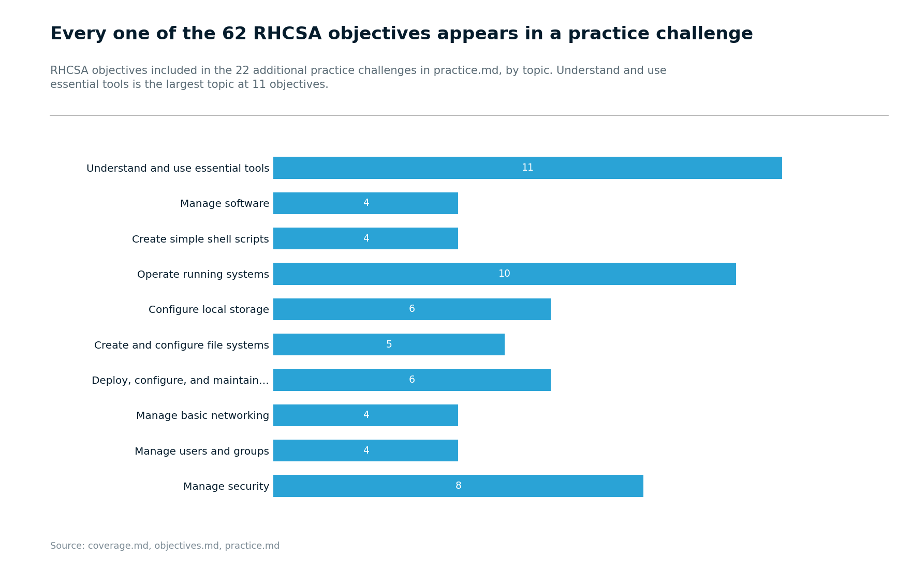

# ICT257: Red Hat System Administration

Use these materials to prepare for the ICT257 Red Hat System Administration course at Singapore University of Social Sciences (SUSS). The course teaches Red Hat Enterprise Linux 10 and covers the RHCSA (EX200) exam objectives.

## Contents

| Path | What is in it |
| --- | --- |
| [`objectives.md`](objectives.md) | RHCSA (EX200) exam objectives with stable IDs |
| [`coverage.md`](coverage.md) | How RH124 and RH134 cover each objective |
| [`lessons.md`](lessons.md) | Twelve weeks of teaching followed by catch-up, revision, and the exam |
| [`pairings.md`](pairings.md) | Commands to pair and forms that survive a reboot |
| [`practice.md`](practice.md) | Optional practice challenges to attempt on your own |
| [`hints.md`](hints.md) | Hints for when you are stuck on the challenges |
| [`readings.md`](readings.md) | Readings for each week with exam tips |
| [`resources.md`](resources.md) | Resources for preparing beyond the courseware |
| [`examples/`](examples/) | Teaching examples and lab exercises for specific chapters |
| [`planner/`](planner/) | A study planner with revision dates |
| [`exam-day.md`](exam-day.md) | What the exam environment is like on the day |

## Get the material

Clone the repository to download all course materials:

```bash
git clone https://github.com/eugeneteo/ict257.git
cd ict257
```

Update your copy periodically to receive changes:

```bash
git pull
```

## Add your own notes

Store your personal notes in `my-notes/`. Git ignores this folder, so your notes stay local and `git pull` never overwrites them.

Do not edit the provided files. If you edit a file that also receives an update, `git pull` stops to protect your changes.

## Use semester snapshots

Git tags mark semester snapshots. To list all available tags:

```bash
git tag --list
```

To view the repository state at a specific tag:

```bash
git checkout TAG
```

To return to the current version:

```bash
git switch main
```

## What the course teaches

The following diagrams show when exam objectives appear during the semester and when you can practice them.

**How many objectives each week covers**

<picture>
  <source media="(prefers-color-scheme: dark)" srcset="images/01-what-each-week-teaches-dark.png">
  
</picture>

**When each topic appears**

<picture>
  <source media="(prefers-color-scheme: dark)" srcset="images/04-when-each-topic-is-taught-dark.png">
  
</picture>

**When practice challenges become available**

<picture>
  <source media="(prefers-color-scheme: dark)" srcset="images/03-when-you-can-practise-dark.png">
  
</picture>

**Practice coverage by exam topic**

<picture>
  <source media="(prefers-color-scheme: dark)" srcset="images/02-practice-coverage-by-topic-dark.png">
  
</picture>

## License

The writing in this repository is licensed under [CC BY-SA 4.0](LICENSE). You may use, modify, and share it as long as you provide attribution and share any derivative works under the same license.

Red Hat's exam objectives and quoted text belong to Red Hat and appear here with attribution and links to the source. Red Hat, RHCSA, and the certification names are Red Hat trademarks.
