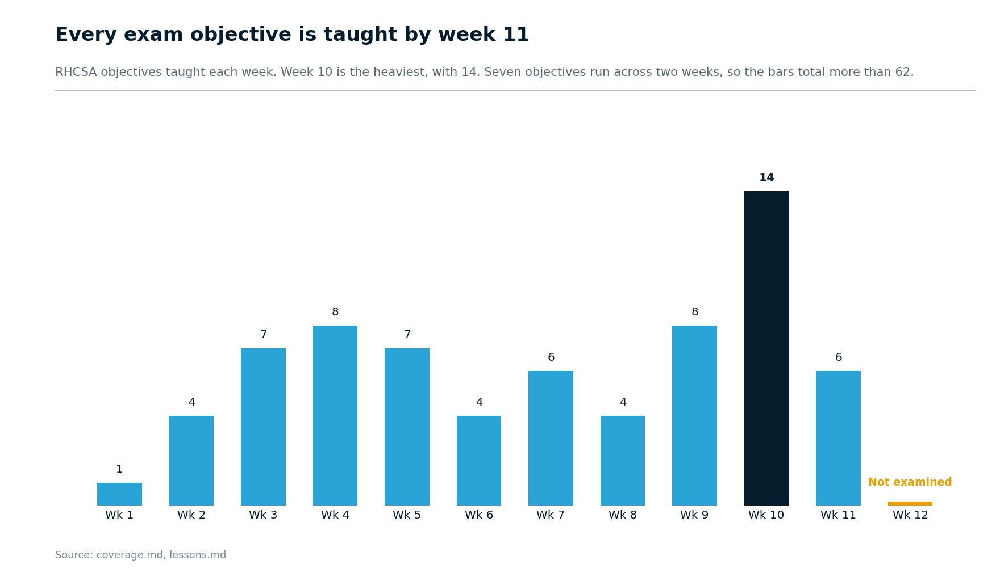
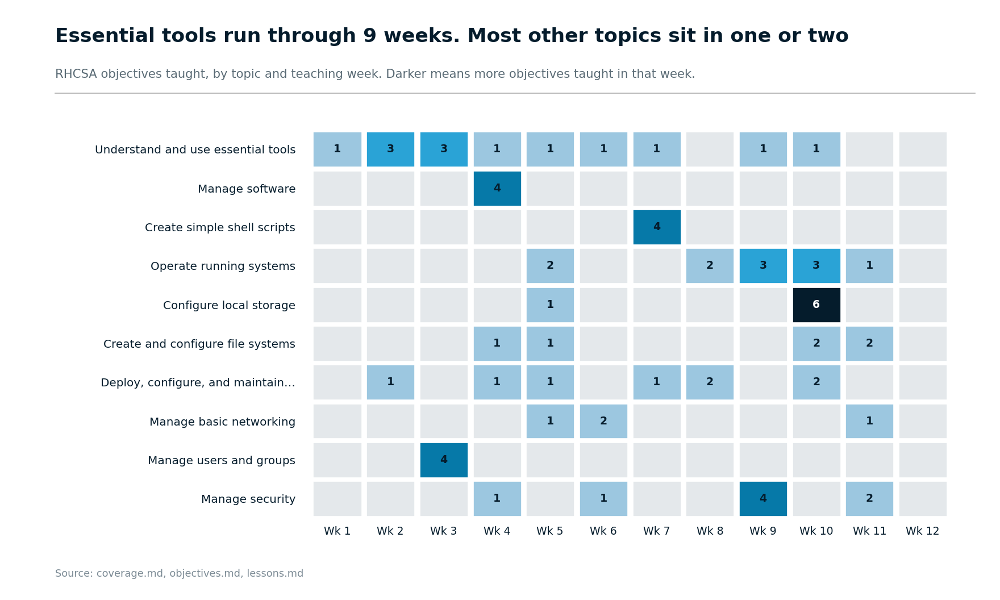
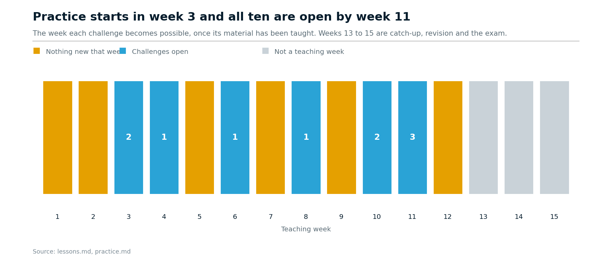

# ICT257: Red Hat System Administration

Module material and notes for
[ICT257 Red Hat System Administration](https://www.suss.edu.sg/courses/detail/ict257),
at the Singapore University of Social Sciences (SUSS). We focus on Red Hat
Enterprise Linux 10.

## Contents

| Path | What is in it |
| --- | --- |
| [`objectives.md`](objectives.md) | RHCSA (EX200) exam objectives, with stable IDs |
| [`coverage.md`](coverage.md) | How RH124 and RH134 cover each objective |
| [`lessons.md`](lessons.md) | Twelve weeks of teaching, then catch-up, revision and the exam |
| [`pairings.md`](pairings.md) | Commands to pair, and forms that survive a reboot |
| [`practice.md`](practice.md) | Practice challenges to attempt on your own |
| [`resources.md`](resources.md) | Resources for preparing beyond the courseware |
| [`exam-day.md`](exam-day.md) | What the exam environment is like on the day |

I will add more as the semester goes on.

## The shape of the module

<picture>
  <source media="(prefers-color-scheme: dark)" srcset="images/01-what-each-week-teaches-dark.png">
  
</picture>

<picture>
  <source media="(prefers-color-scheme: dark)" srcset="images/04-when-each-topic-is-taught-dark.png">
  
</picture>

<picture>
  <source media="(prefers-color-scheme: dark)" srcset="images/03-when-you-can-practise-dark.png">
  
</picture>

These are drawn from the files above, so they follow the material rather than
being kept up to date by hand.

## Getting the material

    git clone https://github.com/eugeneteo/ict257.git
    cd ict257

Run `git pull` now and then to receive updates.

Keep your own notes in `my-notes/`. Git ignores that folder, so nothing you
write there gets committed, and `git pull` will never touch it.

Do not edit the files listed above. If you and I change the same file,
`git pull` may stop to protect your local changes.

Semester snapshots can use tags. List the tags that are available:

    git tag --list

To read one of them:

    git checkout TAG

`git switch main` brings you back to the current version.

## Licence

My writing here is licensed [CC BY-SA 4.0](LICENSE). Use it, change it, share
it, as long as you credit it and pass on the same freedom.

Red Hat's exam objectives and the other wording quoted from their pages belong
to Red Hat, not to me. They appear here with attribution and a link to the
source. Red Hat, RHCSA and the certification names are Red Hat trademarks.
